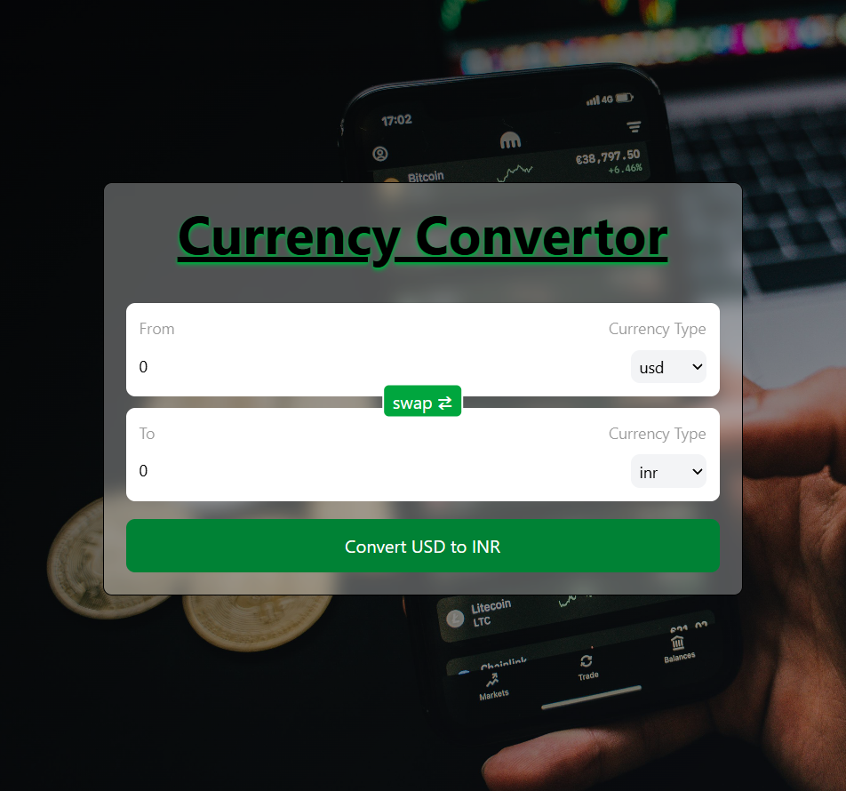

# 💱 Currency Converter (React)

A modern **Currency Converter web application** built using **React** and **Tailwind CSS**, powered by a **real-time currency exchange API**.  
This project demonstrates **custom hooks, API integration, state management, and clean UI design**.



Click to Go Live : [Currency Convertor Live](https://currencyc-convertor-gaurav.vercel.app/)
---

## ✨ Features

- 🌍 Supports **200+ world currencies**
- 🔄 Real-time currency conversion
- 🔁 **Swap currencies** with one click
- ⚛️ Custom React Hook for API handling
- 🎨 Modern **Glassmorphism UI**
- 📱 Fully responsive design
- ⚡ Fast & lightweight (Vite)

---

## 🧠 Key Concepts Used

- Custom Hooks (`useCurrencyinfo`)
- `useState` & `useEffect`
- API fetching & data transformation
- Component reusability
- Conditional rendering
- Event handling
- Tailwind CSS utility-first styling

---

## 🧩 Project Structure

```text
05CurrencyConverter/
│
├── public/
├── src/
│   ├── assets/
│   ├── components/
│   │   └── InputBox.jsx
│   ├── hooks/
│   │   └── useCurrencyinfo.js
│   ├── App.jsx
│   ├── App.css
│   ├── main.jsx
│   └── index.css
│
├── index.html
├── package.json
├── vite.config.js
└── README.md
```

## 🔌 API Used
### Fawaz Ahmed Currency API
```bash

https://cdn.jsdelivr.net/npm/@fawazahmed0/currency-api@latest/v1/currencies

```
- ree & open-source

- No API key required

- Supports all major & minor currencies

---
## 🔄 Swap Functionality

- Instantly swaps From ↔ To currencies

- Automatically recalculates the converted amount

- Improves user experience & efficiency

---

## ▶️ How to Run Locally
```bash

git clone https://github.com/your-username/currency-converter.git

cd currency-converter

npm install

npm run dev

```

## 📈 Learning Outcomes

- Through this project, I learned:

- How to design and use custom hooks

- How to consume third-party APIs efficiently

- How to structure scalable React projects

- How to build clean, professional UIs

- How to handle real-world edge cases in frontend apps

## 🚀 Future Enhancements

- Loading & error states

- Currency flags

- Historical exchange rates

- Dark / Light mode toggle

- Deployment on Vercel

- Unit testing
---

## 🧑‍💻 Author

Gaurav Kumar<br>
🎓 B.Tech in Computer Science & Engineering<br>
💡 Learning React through practical implementation & consistency<br>
💡 Passionate about Artificial Intelligence, Software Development, and Full Stack Projects<br>
📧 LinkedIn: [Gaurav Kumar](https://www.linkedin.com/in/gaurav-kumar-25-oct?lipi=urn%3Ali%3Apage%3Ad_flagship3_profile_view_base_contact_details%3BW7%2FB5onwS4yNaZXl9gxzoA%3D%3D)<br>
GitHub: [KumarGaurav007](https://github.com/KumarGaurav007)

### ⭐ If you like this project, don’t forget to star the repo!