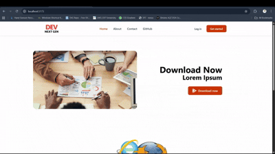

# 🚀 NextGen Dev

**NextGen Dev** is a modern, responsive **React-based website** built to practice and demonstrate **React Router, dynamic routing with Outlet, API integration, hooks, and Tailwind CSS**.


This project focuses on **real-world SPA (Single Page Application) architecture**, where the **Header and Footer remain constant** while page content updates dynamically.

---

## Live Demo (GIF)


## ✨ Key Features

- ⚛️ Built with **React**
- 🔀 Client-side routing using **React Router DOM**
- 🧩 **Dynamic routing with `<Outlet />`**
- 🧠 Extensive use of **React Hooks**
- 🎨 Modern UI with **Tailwind CSS**
- 🔗 **GitHub API integration** to fetch real-time data
- 📱 Fully responsive design
- ⚡ Fast performance using **Vite**

---

## 🧠 Concepts Learned & Implemented

- React Router v6
- `BrowserRouter`, `Routes`, `Route`
- Layout-based routing
- `<Outlet />` for dynamic page rendering
- API fetching using `fetch`
- State & side-effect management using hooks
- Component-based architecture
- Reusable UI components

---

## 🧩 Project Structure

```text
06NextGenDev/
│
├── public/
├── src/
│   ├── assets/
│   ├── components/
│   │   ├── Header.jsx
│   │   ├── Footer.jsx
│   │   ├── Home.jsx
│   │   ├── About.jsx
│   │   ├── Contact.jsx
│   │   └── GitHub.jsx
│   │
│   ├── App.jsx
│   ├── App.css
│   ├── main.jsx
│   └── index.css
│
├── index.html
├── package.json
├── vite.config.js
└── README.md
```
---

## 🔀 Routing Architecture (Core Highlight)

- Header & Footer remain fixed across all pages

- Page content changes dynamically using `<Outlet />`

- Clean and scalable layout-based routing

```text
<Header />
<Outlet />
<Footer />
```

---

## 🔗 GitHub API Integration

```bash 
https://api.github.com/users/{user-name}
```

- Fetches real-time GitHub profile data

- Displays dynamic information such as:

    - Username

    - Profile Image

    - Profile details

- Other public GitHub data

- Demonstrates real-world API consumption in React

---

## ▶️ How to Run Locally
```bash
https://github.com/KumarGaurav007/React-Projects/06NextGenDev.git

cd 06NextGenDev

npm install

npm run dev
```

---

## 📈 Learning Outcomes

- Through this project, I gained hands-on experience with:

- Building SPAs using React Router

- Designing layout-based routing systems

- Managing dynamic data with APIs

- Structuring scalable React projects

- Creating modern UI using Tailwind CSS

---

## 🚀 Future Enhancements

- Loading & error states for API calls

- Dark / Light mode

- Animation with Framer Motion

- Contact form validation

- Deployment on Vercel

- SEO optimization

---

## 🧑‍💻 Author

Gaurav Kumar<br>
🎓 B.Tech in Computer Science & Engineering<br>
💡 Learning React through practical implementation & consistency<br>
💡 Passionate about Artificial Intelligence, Software Development, and Full Stack Projects<br>
📧 LinkedIn: [Gaurav Kumar](https://www.linkedin.com/in/gaurav-kumar-25-oct?lipi=urn%3Ali%3Apage%3Ad_flagship3_profile_view_base_contact_details%3BW7%2FB5onwS4yNaZXl9gxzoA%3D%3D)<br>
GitHub: [KumarGaurav007](https://github.com/KumarGaurav007)

### ⭐ If you like this project, don’t forget to star the repo!